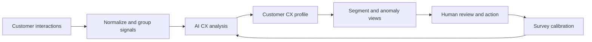

# CX-Inn Case Study

> AI-supported B2B customer experience platform that turns customer interactions into CX signals, risk visibility, and operational action.

CX-Inn is a private product prototype focused on improving how B2B companies understand customer experience without relying only on surveys.

The product explores a simple but important question:

Can customer experience be measured from the signals already present in daily customer operations?

---

## Problem

Many CX programs still depend heavily on NPS, CSAT, and other survey-based measurement flows.

Surveys are useful, but they create several product and operational limitations:

- response rates are often low,
- signals arrive late,
- many customers remain unscored,
- customer issues are discovered after the moment of action has passed,
- teams still need to manually interpret pain points, trends, and churn indicators,
- survey fatigue reduces the quality of future feedback.

The larger problem is not only measurement.

It is the gap between customer interactions and business action.

Customer signals already exist in chats, tickets, calls, emails, complaints, repeated topics, unresolved issues, and support history. The challenge is turning those scattered signals into a system that product, CX, and operations teams can trust.

---

## Product Approach

CX-Inn was designed around a signal-first CX model.

Instead of waiting for every customer to answer a survey, the platform analyzes existing customer interactions and produces current CX indicators at the customer and segment level.

The system does not treat AI as a simple scoring layer.

The product approach combines:

- interaction ingestion and normalization,
- customer-level AI analysis,
- NPS and CSAT prediction,
- sentiment and churn-risk detection,
- pain-point extraction,
- anomaly surfacing,
- segment-level CX reporting,
- selective survey use for calibration,
- human approval flows for campaigns and outbound actions.

The core product decision was to use surveys as a calibration mechanism, not as the only source of customer experience truth.

---

## Product Principles

| Principle | Product Meaning |
|---|---|
| Signal-first CX | Use existing customer interactions as the primary source of experience signals |
| Survey as calibration | Keep surveys for ground truth and model correction, not constant interruption |
| Human-in-the-loop action | AI can recommend, but risky customer actions should remain reviewable |
| Trust before automation | Scores need confidence, explanation, and auditability before teams act on them |
| Tenant-safe intelligence | Customer data, AI keys, and analysis context must stay tenant-scoped |
| Operational usefulness | Insights must lead to customer, campaign, support, or retention actions |

---

## Capability Map

| Capability | Product Value |
|---|---|
| AI-based NPS and CSAT prediction | Gives teams a CX view even when surveys are missing |
| Sentiment and churn-risk detection | Helps prioritize accounts that may need attention |
| Pain-point extraction | Turns raw interactions into recurring business themes |
| Anomaly detection | Surfaces unusual or high-risk customer patterns earlier |
| Segment-level reporting | Helps teams compare experience trends across customer groups |
| Prediction accuracy loop | Compares AI predictions with real survey responses and improves future analysis |
| Hyper-personalized campaigns | Translates CX signals into targeted customer communication |
| Approval workflows | Keeps AI-generated customer actions under human control |
| Role-based access control | Supports enterprise usage across CX users, managers, and admins |
| PII masking and tenant isolation | Makes AI usage safer for sensitive customer operations |
| API and webhook support | Connects CX signals back into operational systems |

---

## Product Flow

---

## AI System Design

CX-Inn is built around an AI analysis engine that reviews recent customer interactions and produces structured CX outputs.

The analysis includes predicted experience scores, sentiment, churn risk, pain points, key topics, summary, and recommendations. These outputs are stored as product data, not just displayed as one-off AI responses.

That distinction matters.

For AI to create operational value, the output needs to become part of the product workflow:

- visible in customer profiles,
- filterable in customer lists,
- aggregated in dashboards,
- available for segment analysis,
- usable in campaign targeting,
- comparable with real survey responses,
- traceable through audit and approval flows.

The product is designed so that AI supports decision quality rather than replacing the team's accountability.

---

## Trust, Safety, and Calibration

A CX system that scores customers from operational data needs a strong trust layer.

CX-Inn includes several product and architecture decisions for this:

- tenant-scoped data access,
- per-tenant AI key handling,
- no cross-tenant AI context sharing,
- PII masking before AI analysis,
- role-based permissions,
- approval flows for campaigns and surveys,
- audit logs for sensitive actions,
- prediction accuracy tracking against real survey responses.

The calibration loop is especially important.

When a real survey response arrives, the system can compare the actual score with the earlier AI prediction. This creates a feedback layer for measuring prediction error and improving future analysis.

This changes the product from a static AI demo into a measurable CX intelligence system.

---

## From Insight to Action

The main product value is not the score itself.

The value comes from helping teams answer operational questions faster:

- Which customers may be at risk?
- Which pain points are increasing?
- Which segments are showing negative experience trends?
- Where should a CX manager investigate first?
- Which customers need a targeted survey instead of a broad campaign?
- Which communication should be reviewed before being sent?

CX-Inn connects these questions to customer profiles, dashboards, anomaly views, segmentation, campaign generation, and approval workflows.

That is the difference between AI insight and AI product value.

---

## Product Value

CX-Inn creates value by helping CX, product, and operations teams move from delayed measurement toward continuous signal interpretation.

The main benefits are:

- broader CX visibility beyond survey respondents,
- earlier churn-risk detection,
- faster identification of recurring customer pain points,
- reduced survey dependency and survey fatigue,
- better prioritization for CX and account teams,
- more measurable AI-driven decision support,
- clearer connection between customer operations and product strategy.

The strategic value is the shift from asking customers for feedback after the fact to learning from the interactions they are already having with the business.

---

## What This Project Shows

CX-Inn reflects my product focus on AI systems that connect customer experience, operational reality, and business value.

It combines:

- AI product strategy,
- B2B customer experience design,
- survey and feedback systems,
- churn-risk and sentiment intelligence,
- human-in-the-loop workflow design,
- enterprise-grade access and approval thinking,
- operational data pipelines,
- measurable AI calibration.

For me, this is where AI becomes meaningful in product leadership: not by producing more outputs, but by turning existing customer signals into decisions teams can trust and act on.

---

## Disclosure Note

This case study intentionally avoids private code, customer data, credentials, named customer datasets, and implementation details that should remain private.
