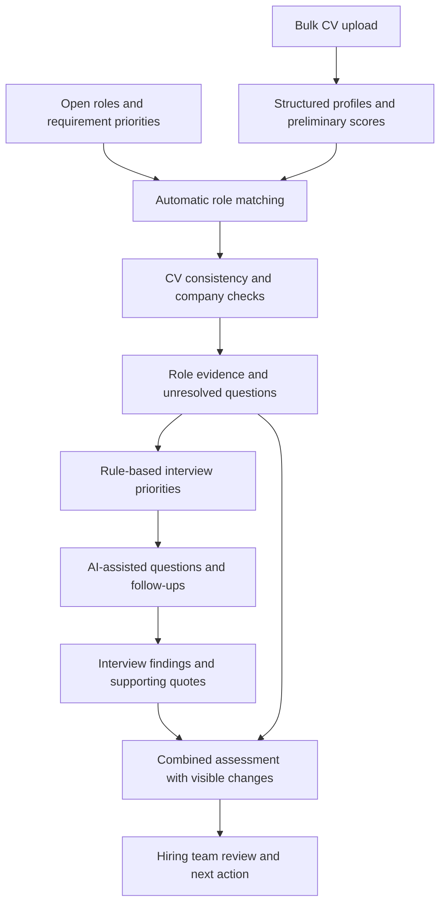

# Talent-Inn Case Study

> From bulk CV intake and open-role matching to evidence checks, focused interviews, and reviewable hiring decisions.

Talent-Inn is an AI-supported recruitment and candidate operations prototype. The product connects bulk CV intake, preliminary scoring, matching against open positions, CV verification, interviews, and follow-up in one workflow. Its source repository is named `TalentFlow`; the product name is Talent-Inn.

The product question behind it is:

**How can a hiring team turn what it does not yet know about a candidate into the next useful question, while retaining the evidence behind its decisions?**

[Product repository](https://github.com/emredemir-maker/TalentFlow)

## Problem

Candidate information arrives through CVs, applications, emails, and interviews. Each step adds context, but that context can become fragmented across people and tools.

A hiring manager needs more than a ranked list. They need to understand which requirements have supporting evidence, which remain uncertain, and what the interview should establish next. A high score without that context can conceal an unresolved mandatory requirement. A low score can also reflect an incomplete CV rather than a lack of ability.

Talent-Inn addresses the operational gap between a growing candidate pool, multiple open roles, and the evidence needed to progress a hiring decision. Reviewing each CV separately for every opening adds repeated work; matching alone is also insufficient when the underlying experience is unclear or inconsistent.

## Users and Workflow

| User | Job to Be Done |
|---|---|
| Recruiter | Organize candidate information, prioritize review, prepare interviews, and coordinate communication |
| Hiring manager | Inspect role-specific evidence, identify unresolved requirements, and review interview findings |
| Candidate | Submit information and participate in the application and interview workflow |

The implementation includes bulk candidate intake and preliminary scores, automatic role matching, CV consistency and company checks, comparison views, interview planning and reports, messaging, and pipeline analytics. This case study follows the candidate from intake through evidence review to the hiring team's decision.

## Product Approach

The workflow starts with bulk CV intake and open-role definitions. Requirements can be marked as mandatory or preferred, giving the evaluation an explicit reference point. Preliminary scoring helps organize incoming candidates, while deeper matching evaluates evidence against role requirements.

AI extracts structured evidence and assesses each requirement. CV verification adds internal consistency checks and external company context. Application logic turns assessments into a score, identifies gaps, and builds a prioritized interview plan. The language model then helps phrase questions and follow-ups for the selected topics.

Interview findings remain a separate source of evidence. They can change the combined assessment while preserving the original CV evaluation and making the change inspectable.

## Key Product Decisions

### Bulk Intake with Preliminary Scoring

The bulk-import workflow processes CV sources into candidate records and generates preliminary scores during intake. Files are uploaded to storage before the backend processes them; the UI tracks job progress and failures. This makes batch handling part of the workflow rather than requiring recruiters to repeat single-candidate entry.

Preliminary scores and suggested role matches help prioritize review. The implementation records whether a preliminary score came from AI or a keyword fallback. This early signal is distinct from the deeper requirement-level assessment and should not be read as a final hiring judgment.

### Match Candidates to Existing Open Roles

Matching uses candidate skills and experience together with open-position definitions. The matching service includes domain filtering and requirement-aware scoring, while the deeper scan evaluates selected compatible positions and keeps position-specific analyses.

This supports a pool-oriented workflow: a CV can be considered against current openings rather than remaining tied only to a manually chosen role. The deeper scan narrows large compatible-role lists before making model calls; it does not exhaustively evaluate every opening on every run.

### Check the Evidence Behind the CV

Verification combines internal date/experience consistency checks, external company information, and sector context. Reports retain flags, sources, unanswered questions, and information about checks that were skipped or failed. Manually supplied company confirmations are distinguished from external sources.

A company found online does not prove that the candidate worked there, and an unsuccessful lookup does not prove a false claim. The useful output is a reviewable discrepancy or question. For example, overlapping employment dates can lead to a question about concurrent roles rather than an unsupported conclusion about dishonesty.

Verification summaries can also affect the displayed score through separate adjustment logic. Those adjustments are provisional, as described below, and need calibration and reviewer scrutiny.

### Separate Assessment from Explanation

The code separates the compact AI response that determines requirement assessments from the longer narrative explaining the evidence. The narrative is merged with the assessment by requirement index.

This limits how much explanatory text generation can influence scoring. The scoring service also raises an error for unreadable or empty assessment results, so those failures do not silently become a zero-score evaluation.

The distinction matters: a failed model call is a system failure, not evidence against a candidate. Separating the calls reduces coupling, but does not guarantee that the model will make identical judgments on repeated runs.

### Make Mandatory Gaps Visible

Mandatory requirements have a separate status alongside the overall score. The gate can report met, partial, missing, or unknown; it also provides a ranking priority for the interface.

This keeps a strong aggregate score from concealing a mandatory gap. The gate supplies decision support rather than an automatic rejection action. Its effect on visibility and ranking still makes human review important.

### Turn Uncertainty into an Interview Plan

Application code selects the topics, priority order, and time allocation. Missing and partially supported mandatory requirements receive priority; additional verification topics can use remaining time.

AI writes a question, a follow-up, and observable signals to listen for. If question generation fails or omits a topic, fallback questions keep the selected topics in the plan.

The product therefore connects the interview to the uncertainty discovered during screening. Two candidates applying for the same role can receive different preparation because their evidence gaps differ.

### Preserve the Reason a Score Changed

CV assessments and interview findings are stored separately. At read time, conclusive interview findings can update the combined requirement assessment in either direction. Inconclusive findings leave the CV assessment unchanged.

The resulting changes include the requirement, previous and new status, and supporting quote. The interface can show both the CV score and the updated score.

This supports a concrete explanation such as: a requirement was only partially supported in the CV, but the interview supplied additional evidence. The original record remains available for comparison.

### Treat Role Changes as Evaluation Changes

Requirement fingerprints identify assessments made against an older role definition. Stale assessments are flagged, and the relevant gate and interview-merging logic avoid applying old judgments to a changed requirement list.

This addresses an easily overlooked workflow problem: when a role changes, yesterday's assessment may no longer answer today's hiring question.

## Illustrative Scenario

Consider a product role requiring ownership of an end-to-end product launch. A candidate's CV mentions participation in several launches, but does not establish their personal responsibility.

The assessment may identify partial evidence. The interview plan prioritizes that uncertainty and asks for a concrete example, followed by a question about the candidate's own decisions and contribution.

If the interview provides conclusive evidence, the combined assessment can change with its supporting quote. If the topic remains unresolved, the workflow retains that uncertainty for the hiring team.

This is an illustration of the implemented workflow, not a reported customer result.

## Architecture and Operations

| Layer | Implementation and Purpose |
|---|---|
| Application | React and Vite interface for candidates, positions, interviews, and reporting |
| Evaluation logic | Shared utilities for requirement versions, scores, mandatory gates, interview priorities, and evidence merging |
| AI services | Gemini-backed assessment and generation through a backend proxy |
| Backend | Node.js/Express services and Firebase Cloud Functions structure |
| Data and identity | Firebase Authentication, Firestore, and storage workflows |
| Workflow support | Document parsing, email/calendar integrations, candidate messaging, and analytics |

The reviewed AI proxy uses Firebase token verification, rate limiting, and bounded output-token settings. The client passes feature labels so AI usage can be attributed to the initiating feature.

The code also includes PII-stripping utilities and role-dependent masking. These are implementation mechanisms, not proof that every document or integration path is anonymized or that deployment requirements have been fully validated.

## Human Judgment and Limits

The hiring team remains responsible for interpreting evidence and making hiring decisions. AI supplies assessments, questions, and summaries; those outputs still require scrutiny.

Several limits are material to the product:

- CV evidence quality can affect a score without fully representing a person's capability.
- Model judgments and generated explanations can be incomplete or inconsistent.
- Verification and sector-fit adjustments can influence scores. Their coefficients are explicitly described in the code as provisional, so calibration remains necessary.
- Requirement definitions and ranking rules can introduce bias even when an interface explains them clearly.
- This case study does not establish production readiness, fairness, predictive validity, or measured hiring outcomes.

## Measuring Product Value

The intended value is more focused preparation, more consistent review, and clearer ownership of the next step. A pilot should test these hypotheses with a baseline rather than treating implementation as proof of impact.

| Proposed Measure | What It Would Test |
|---|---|
| Median interview preparation time | Whether the generated plan reduces preparation effort |
| Share of priority gaps addressed during interviews | Whether screening actually improves the interview agenda |
| Repeated-assessment agreement on the same inputs | Whether AI requirement judgments are stable enough for the workflow |
| Reviewer correction rate, with reasons | Where assessments or explanations need improvement |
| Share of changed assessments with supporting evidence | Whether decisions remain traceable as new information arrives |
| Failed analyses and AI cost per completed review | Whether operational reliability and cost support repeated use |

No measured improvement is claimed here. These are proposed validation metrics.

## What This Project Shows

Talent-Inn reflects my approach to AI product leadership: connect interpretation to a useful next action, decide which rules should be explicit, and preserve enough context for people to question the output.

The central design contribution is the continuity between bulk intake, role matching, verification, interview evidence, and team review. AI creates value when those steps work together and the team can explain both the candidate's position in the workflow and why its assessment changed.

## Implementation Evidence

Reviewed against TalentFlow commit [`f6c08ea`](https://github.com/emredemir-maker/TalentFlow/commit/f6c08ea558fb7a789c3e5cb380fa30b82670dbdc). The links below pin the implementation reviewed for this case study.

| Topic | Source |
|---|---|
| Bulk intake and preliminary scoring | [bulkWorker.js](https://github.com/emredemir-maker/TalentFlow/blob/f6c08ea558fb7a789c3e5cb380fa30b82670dbdc/functions/services/bulkWorker.js) |
| Candidate-to-role matching | [matchService.js](https://github.com/emredemir-maker/TalentFlow/blob/f6c08ea558fb7a789c3e5cb380fa30b82670dbdc/src/services/matchService.js) |
| Deeper open-position scanning | [scanService.js](https://github.com/emredemir-maker/TalentFlow/blob/f6c08ea558fb7a789c3e5cb380fa30b82670dbdc/src/services/scanService.js) |
| CV verification and source context | [cvVerification.js](https://github.com/emredemir-maker/TalentFlow/blob/f6c08ea558fb7a789c3e5cb380fa30b82670dbdc/src/services/cvVerification.js) |
| Structured assessment and narrative separation | [coverageScorer.js](https://github.com/emredemir-maker/TalentFlow/blob/f6c08ea558fb7a789c3e5cb380fa30b82670dbdc/src/services/ai/coverageScorer.js) |
| Mandatory requirement states | [mustHaveGate.js](https://github.com/emredemir-maker/TalentFlow/blob/f6c08ea558fb7a789c3e5cb380fa30b82670dbdc/src/utils/mustHaveGate.js) |
| Rule-based interview planning | [interviewPlan.js](https://github.com/emredemir-maker/TalentFlow/blob/f6c08ea558fb7a789c3e5cb380fa30b82670dbdc/src/utils/interviewPlan.js) |
| Question generation and fallbacks | [interviewPlanner.js](https://github.com/emredemir-maker/TalentFlow/blob/f6c08ea558fb7a789c3e5cb380fa30b82670dbdc/src/services/ai/interviewPlanner.js) |
| CV and interview evidence merging | [interviewCoverage.js](https://github.com/emredemir-maker/TalentFlow/blob/f6c08ea558fb7a789c3e5cb380fa30b82670dbdc/src/utils/interviewCoverage.js) |
| Shared score computation | [positionScore.js](https://github.com/emredemir-maker/TalentFlow/blob/f6c08ea558fb7a789c3e5cb380fa30b82670dbdc/src/utils/positionScore.js) |
| Provisional verification adjustments | [verificationScore.js](https://github.com/emredemir-maker/TalentFlow/blob/f6c08ea558fb7a789c3e5cb380fa30b82670dbdc/src/utils/verificationScore.js) |
| Interview workflow UI | [InterviewPlanPanel.jsx](https://github.com/emredemir-maker/TalentFlow/blob/f6c08ea558fb7a789c3e5cb380fa30b82670dbdc/src/components/InterviewPlanPanel.jsx) |

This is a code-grounded product case study. The review did not execute live AI calls or independently validate end-to-end production behavior. No candidate records or customer data are reproduced.
